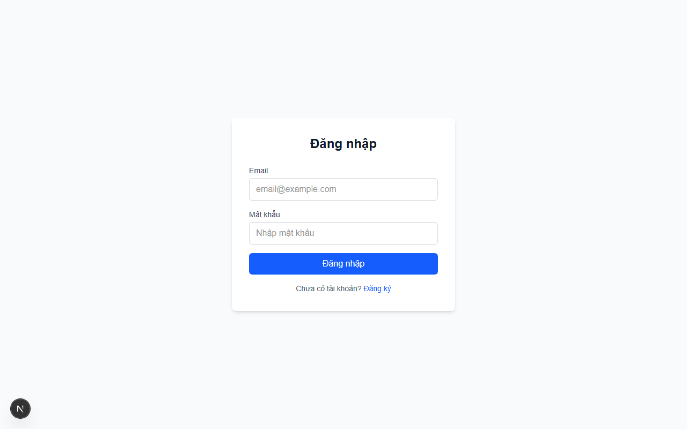
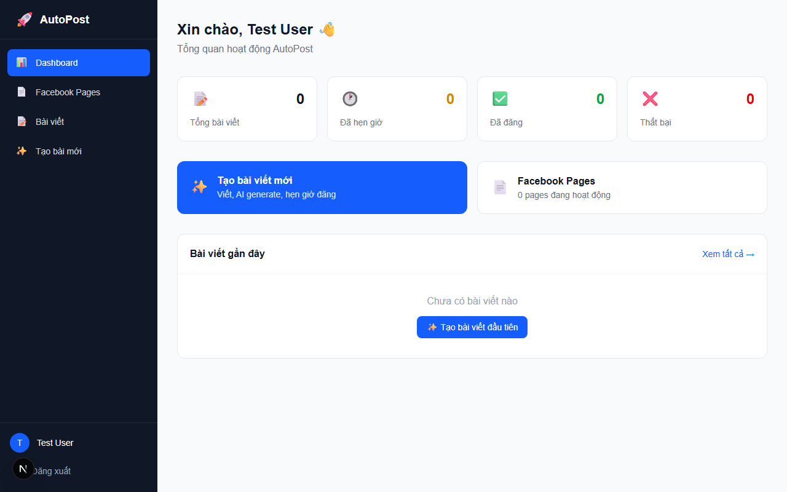
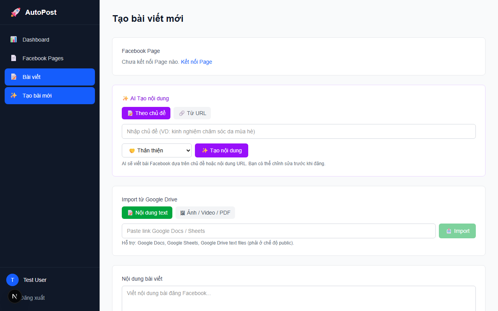
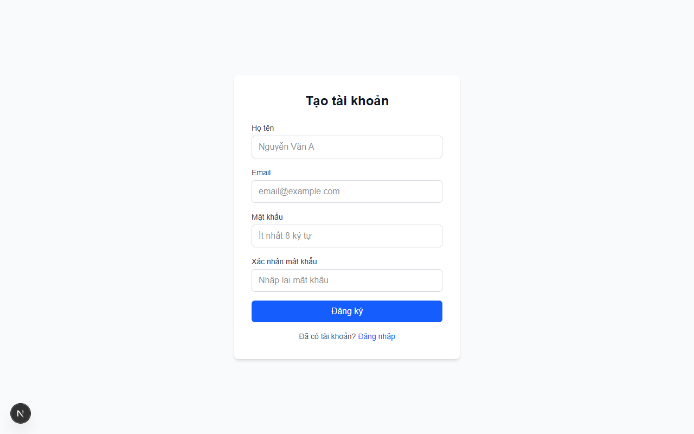

# AutoPost

Quản lý và tự động đăng bài viết lên Facebook Page. Multi-user, AI generate nội dung, hẹn giờ đăng.

## Screenshots

| Login | Dashboard |
|-------|-----------|
|  |  |

| Tạo bài viết | Đăng ký |
|--------------|---------|
|  |  |

## Tính năng

- **Tạo bài viết** — Nhập tay, import từ Google Drive, hoặc AI generate từ URL/topic
- **Upload media** — Ảnh (JPEG, PNG, GIF, WebP) và video (MP4, MOV), tối đa 10 file/bài
- **Hẹn giờ đăng** — Scheduler nội bộ tự publish bài đúng lịch (interval 30s)
- **AI content** — 5 giọng văn: thân thiện, chuyên nghiệp, hài hước, truyền cảm hứng, kể chuyện
- **Facebook integration** — OAuth connect, long-lived token, binary photo upload qua Graph API v21.0
- **Dashboard** — Sidebar navigation, thống kê, quản lý bài viết theo trạng thái
- **Security** — CSP/HSTS headers, rate limiting, file access control, encrypted tokens

## Tech Stack

| Layer | Technology |
|-------|-----------|
| Framework | Next.js 16 (App Router) |
| Database | SQLite WAL + Drizzle ORM |
| Auth | Better Auth (email/password) |
| AI | OpenAI-compatible API |
| Facebook | Graph API v21.0, OAuth 2.0 |
| Deploy | PM2 + Nginx + Certbot |

## Cài đặt

```bash
git clone https://github.com/dt135/auto-post.git
cd auto-post
npm install

# Tạo file .env
cp .env.production.example .env
# Điền biến môi trường (xem bảng bên dưới)

# Database migration
npx drizzle-kit push

# Dev server
npm run dev
```

## Biến môi trường

| Variable | Mô tả | Cách lấy |
|----------|--------|----------|
| `BETTER_AUTH_SECRET` | Secret cho auth session | `openssl rand -hex 32` |
| `BETTER_AUTH_URL` | URL app (vd: `http://localhost:3000`) | — |
| `ENCRYPTION_KEY` | Key mã hóa Facebook tokens | `openssl rand -hex 32` |
| `FACEBOOK_APP_ID` | Facebook App ID | [Developer Console](https://developers.facebook.com/apps/) |
| `FACEBOOK_APP_SECRET` | Facebook App Secret | [Developer Console](https://developers.facebook.com/apps/) |
| `AI_API_BASE_URL` | API endpoint (kèm `/v1`) | Tùy provider |
| `AI_API_KEY` | API key | Tùy provider |
| `AI_MODEL` | Tên model (vd: `gpt-4o-mini`) | Tùy provider |
| `N8N_API_KEY` | *(Optional)* Key cho n8n polling | `openssl rand -hex 24` |

## Scripts

```bash
npm run dev      # Development server
npm run build    # Production build
npm start        # Start production server
npm run lint     # ESLint
```

## Cấu trúc project

```
src/
├── app/
│   ├── (auth)/           # Login, Register
│   ├── (dashboard)/      # Dashboard, Posts, Pages
│   └── api/              # Auth, AI, Facebook, Posts, Uploads
├── components/           # UI components
├── db/schema/            # Drizzle schema
└── lib/                  # Core logic (auth, ai, facebook, crypto, rate-limit, scheduler)
```

## Deploy

Xem [DEPLOY.md](./DEPLOY.md) để deploy lên VPS Ubuntu với PM2 + Nginx + SSL.

## License

Private.
